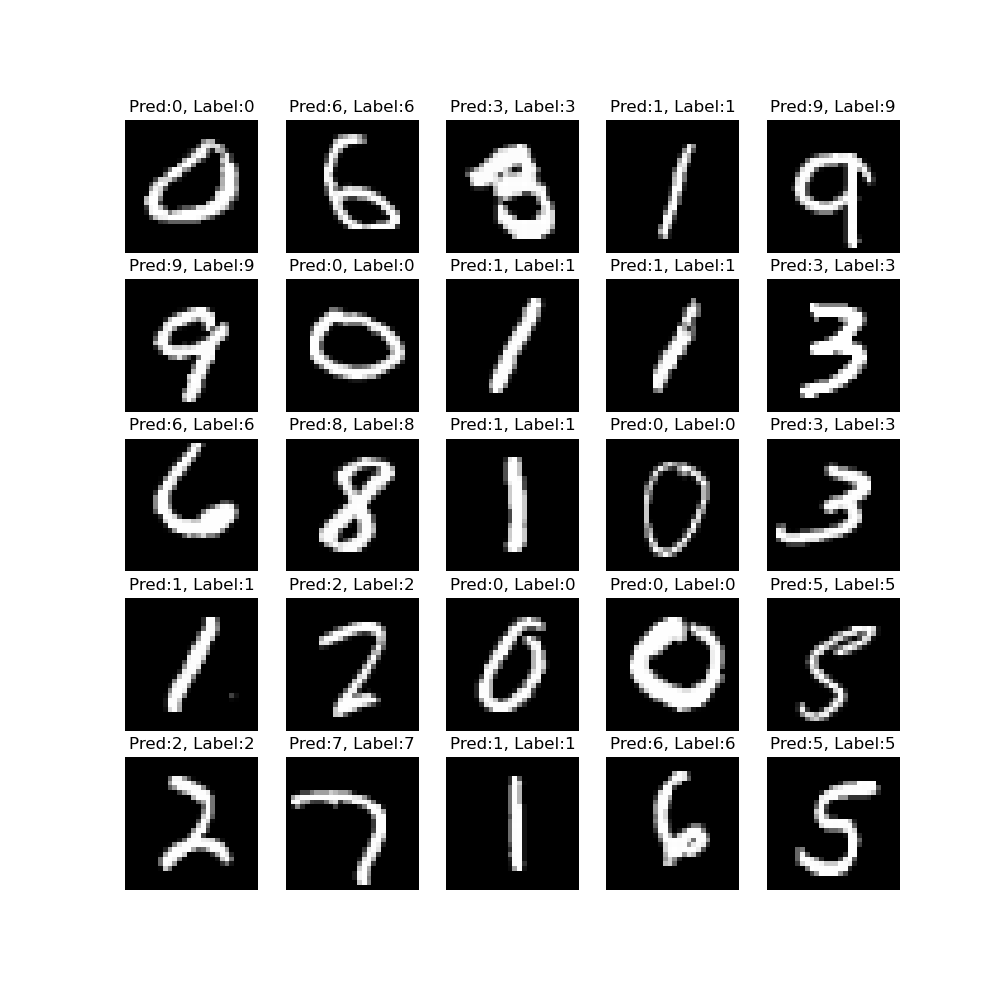

# CAM-loss Implementation by PyTorch
> CAM loss unofficial implementation by pytorch

```sh
# setup
conda create -n cam_loss python=3.9
conda install pytorch==1.7.1 torchvision==0.8.2 torchaudio==0.7.2 cudatoolkit=11.0 -c pytorch
```

mnist 데이터셋이 단순해서 그런지 생각보다 camloss의 성능이 기본 CE loss를 사용한 것 보다 좋지는 못했습니다.(log.txt, cam_loss_log.txt 비교)

cam loss의 아이디어도 기본적으로 roi에 대한 정보를 loss에 사용해 여러 물체가 있을 때 좋은 효과가 나올 것 같습니다.

<br>
(left: CE Loss, right: CAM Loss)
<p align=center>


</p>


[논문 링크](https://arxiv.org/pdf/2109.01359.pdf)
   
[블로그 설명글](https://velog.io/@sihyeong671/PyTorch-CAM-loss-implementation)
