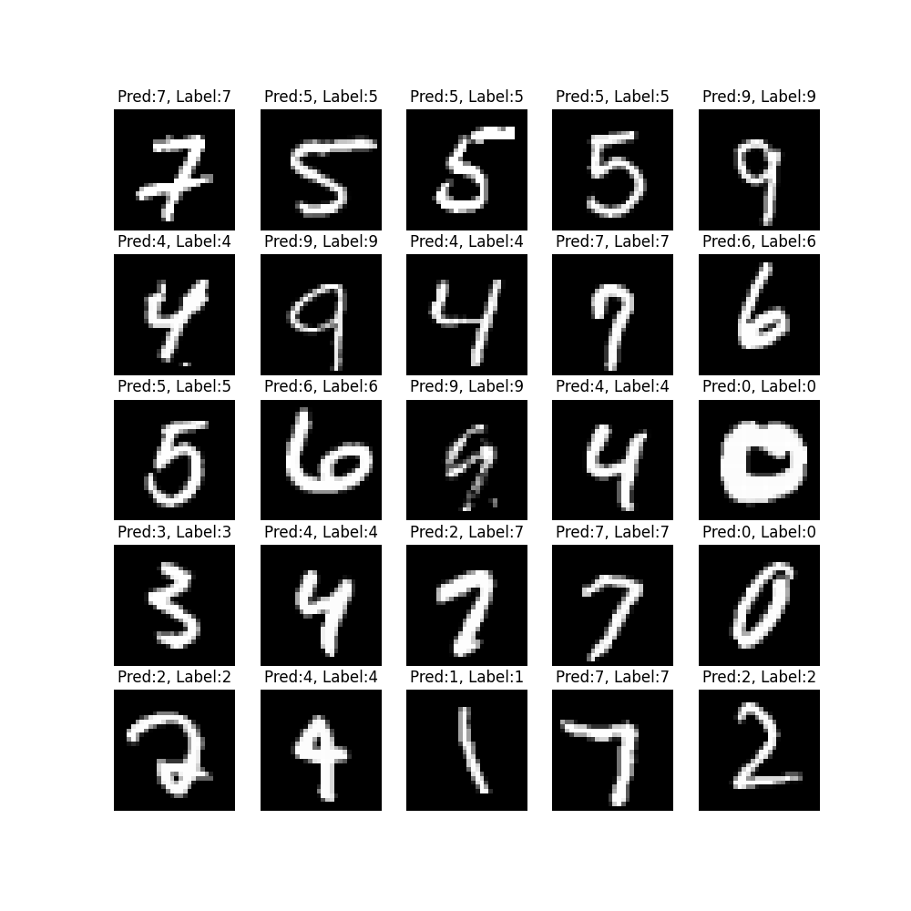

# CAM-loss Implementation by PyTorch
> [CAM loss](https://arxiv.org/pdf/2109.01359.pdf) unofficial implementation by pytorch

## Run
```sh
python run.py

python run.py --use_cam=True
```


## Result
I think CAM loss is not effective in simple image or simple model.
There are also limitations in the model architecture for applying cam loss.
To know experimental results more accurately, maybe I need more experiments is required by changing hyper parameter(eg. alpha, model architecture, ...)


### without cam loss
> best acc : 0.9880<br/>
> best f1 : 0.9883

<p align=center>

</p>

### with cam loss
> best acc : 0.9873<br/>
> best f1 : 0.9877

<p align=center>

</p>